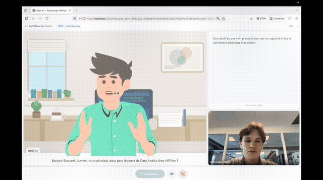
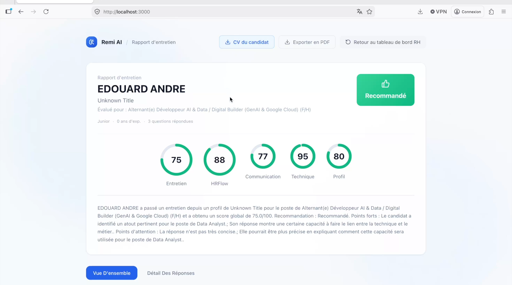
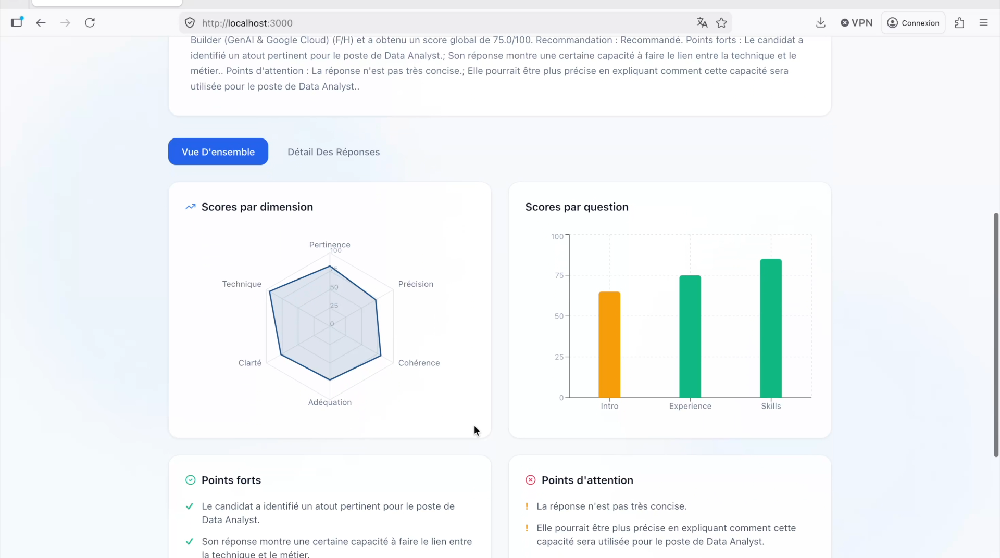
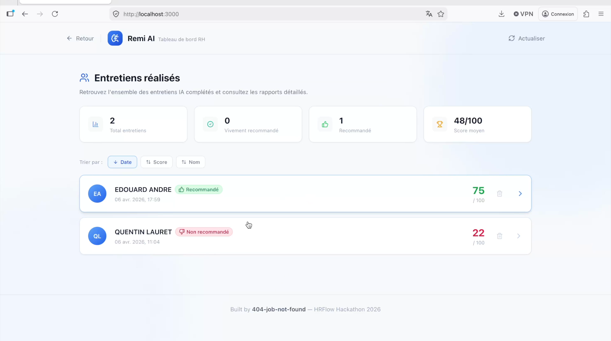

<div align="center">

# Remi AI

## 🏅 FINALIST : HrFlow AI Hackathon

### Automated AI video interview platform

Remi AI puts candidates through a video interview led by a talking avatar, transcribes their answers in real time, scores them automatically, and generates a recruiter-ready hiring report.



Built by 404-job-not-found, HRFlow Hackathon

</div>

## What is Remi AI?

Candidate screening is slow, repetitive, and inconsistent. Remi AI automates the first interview end to end:

1. The recruiter picks a job offer and a candidate (an existing HRFlow profile, or an uploaded CV that gets parsed).
2. The candidate receives a link and goes through a video interview led by an animated avatar that asks questions generated from their profile and the target job offer.
3. The candidate answers by voice. The speech is transcribed locally, then each answer is evaluated by an LLM judge across several dimensions.
4. The recruiter finds a detailed report on an HR dashboard: overall score, HRFlow fit score, per-skill radar, strengths and concerns, transcripts, and a final recommendation.

Everything stays robust without API keys: if the LLM, the speech synthesis, or HRFlow are not configured, the app falls back to local deterministic behavior.

## Features

- Conversational voice interview: animated avatar (Lottie) with synthesized voice (Gradium TTS) and local answer transcription (Whisper via `mlx-whisper`, optimized for Apple Silicon).
- Tailored questions: 3 LLM-generated questions based on the profile and the offer (intro and synthesis, English-language check, skills validation), with a deterministic fallback.
- Automatic scoring (LLM-as-a-judge): per-question rating on clarity, technical accuracy, consistency with the profile, and job alignment, aggregated into an overall score.
- Gaze tracking: webcam-based attention detection (MediaPipe Face Landmarker) that measures when the candidate looks away.
- HRFlow integration: CV parsing, reading of profiles and offers, and native HRFlow profile/job fit grading.
- Full HR report: report page with ring scores, per-dimension radar, per-question chart, link to the CV, and PDF export.
- Recruiter dashboard: list of all past interviews, filters, statistics, and access to detailed reports.

## Overview

### Candidate report

Overall score, HRFlow fit score, and per-dimension ratings.



### Detailed analysis

Per-dimension radar, per-question scores, and a summary of strengths and concerns.



### HR dashboard

All completed interviews, with their scores and recommendation.



## Architecture

```
Frontend  (React, Vite, TypeScript, Tailwind)
    Lottie avatar, webcam + gaze tracking (MediaPipe), charts (Recharts)
    │
    │  Vite proxy: /api -> backend, /hrflow-api -> HRFlow
    ▼
Backend  (FastAPI, uv workspace)
    agent/    question generation, scoring, report
    backend/  API endpoints, sessions, SQLite
    │
    ├─ HRFlow API     CV parsing, profiles, offers, grading
    ├─ LLM (OpenAI)   question generation and scoring
    ├─ Gradium        speech synthesis (TTS)
    └─ Local Whisper  transcription (STT)
```

The project is a `uv` monorepo: the Python backend bundles two packages (`agent` for the AI logic, `backend` for the API), and `frontend/` is a standalone React SPA that proxies calls to the backend and HRFlow.

## Tech stack

| Layer | Technologies |
|-------|--------------|
| Frontend | React 18, Vite, TypeScript, Tailwind CSS, Recharts, Lottie, MediaPipe Tasks Vision |
| Backend | Python, FastAPI, Uvicorn, managed with [`uv`](https://docs.astral.sh/uv/) |
| AI and voice | OpenAI-compatible LLM (questions and scoring), Gradium (TTS), Whisper via `mlx-whisper` (local STT) |
| Integration | HRFlow API (CV parsing, profiles, offers, grading) |
| Storage | SQLite (`backend/interviews.db`) |

## Installation

### Prerequisites

- [`uv`](https://docs.astral.sh/uv/getting-started/installation/) (Python dependency management)
- [Node.js](https://nodejs.org/) 18+ and npm
- Optional: `ffmpeg` (used by audio transcription)

### 1. Clone the repository

```bash
git clone https://github.com/quentin-lauret/hackathon-ai-hr.git
cd hackathon-ai-hr
```

### 2. Configure environment variables

Copy the example files and fill in your keys (all optional, see [Configuration](#configuration)):

```bash
cp .env.example .env
cp frontend/.env.example frontend/.env
```

### 3. Run the backend

```bash
uv run --package backend uvicorn backend.main:app --reload --port 8000
```

`uv` installs the Python dependencies automatically on first run. The API is then available at http://localhost:8000 (interactive docs at http://localhost:8000/docs).

### 4. Run the frontend

In a second terminal:

```bash
cd frontend
npm install
npm run dev
```

The app is available at http://localhost:3000. The Vite server proxies `/api` to the backend (`:8000`) and `/hrflow-api` to the HRFlow API.

## Configuration

All keys are optional: without them, the app uses local deterministic fallbacks (questions and scoring generated without an LLM, no voice).

### Backend (`.env`)

| Variable | Purpose |
|----------|---------|
| `HRFLOW_API_KEY` | HRFlow API key (CV parsing, profiles, offers, grading) |
| `HRFLOW_BASE_URL` | HRFlow API base URL |
| `HRFLOW_SOURCE_KEY` | HRFlow source where parsed profiles are stored |
| `HRFLOW_BOARD_KEY` | HRFlow board for job offers |
| `OPEN_SOURCE_LLM_API_KEY` | OpenAI-compatible LLM key (question generation and scoring) |
| `OPEN_SOURCE_LLM_BASE_URL` | LLM base URL |
| `OPEN_SOURCE_LLM_MODEL` | LLM model name |
| `GRADIUM_API_KEY` | Gradium key for the avatar's speech synthesis |
| `GRADIUM_VOICE_ID` | Gradium voice identifier |
| `WHISPER_MODEL` | Whisper model for transcription (default: `mlx-community/whisper-large-v3-turbo`) |

### Frontend (`frontend/.env`)

| Variable | Purpose |
|----------|---------|
| `VITE_HRFLOW_API_KEY` | HRFlow API key used client-side to read profiles |
| `VITE_HRFLOW_USER_EMAIL` | HRFlow account email |
| `VITE_HRFLOW_SOURCE_KEY` | Default HRFlow source |

## User flow

1. HR dashboard (`/`): the default view, listing completed interviews and giving access to reports.
2. Candidate link: a link containing `source_key` and `profile_key` (or `reference`) opens the interview landing page.
3. Briefing: profile summary, interview outline, camera and mic checks.
4. Interview: the avatar asks 3 questions by voice, the candidate answers out loud.
5. Report: scores, recommendation, transcripts, PDF export, and persistence in the HR dashboard.

## Project structure

```
hackathon-ai-hr/
├── agent/                 # AI logic (Python package)
│   ├── interview_agent.py
│   ├── scorer.py
│   ├── report_builder.py
│   └── prompts.py
├── backend/               # API (Python package)
│   ├── main.py
│   ├── hrflow_client.py
│   ├── gradium_tts.py
│   ├── voxtral_stt.py
│   ├── session_store.py
│   └── database.py
├── frontend/              # React + Vite SPA
│   └── src/
│       ├── pages/         # Landing, Briefing, Interview, Report, HRDashboard...
│       ├── components/    # Webcam, Avatar, ScoreBar
│       └── hooks/         # Media permissions, STT, gaze tracking
├── docs/assets/           # Demo screenshots and GIF
└── pyproject.toml         # uv workspace (agent + backend)
```

<div align="center">

Built by 404-job-not-found, HRFlow Hackathon

</div>
