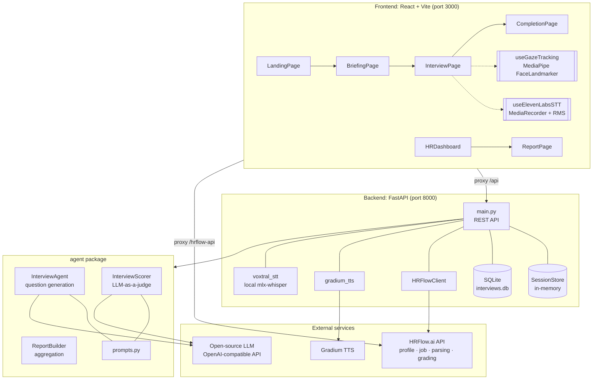
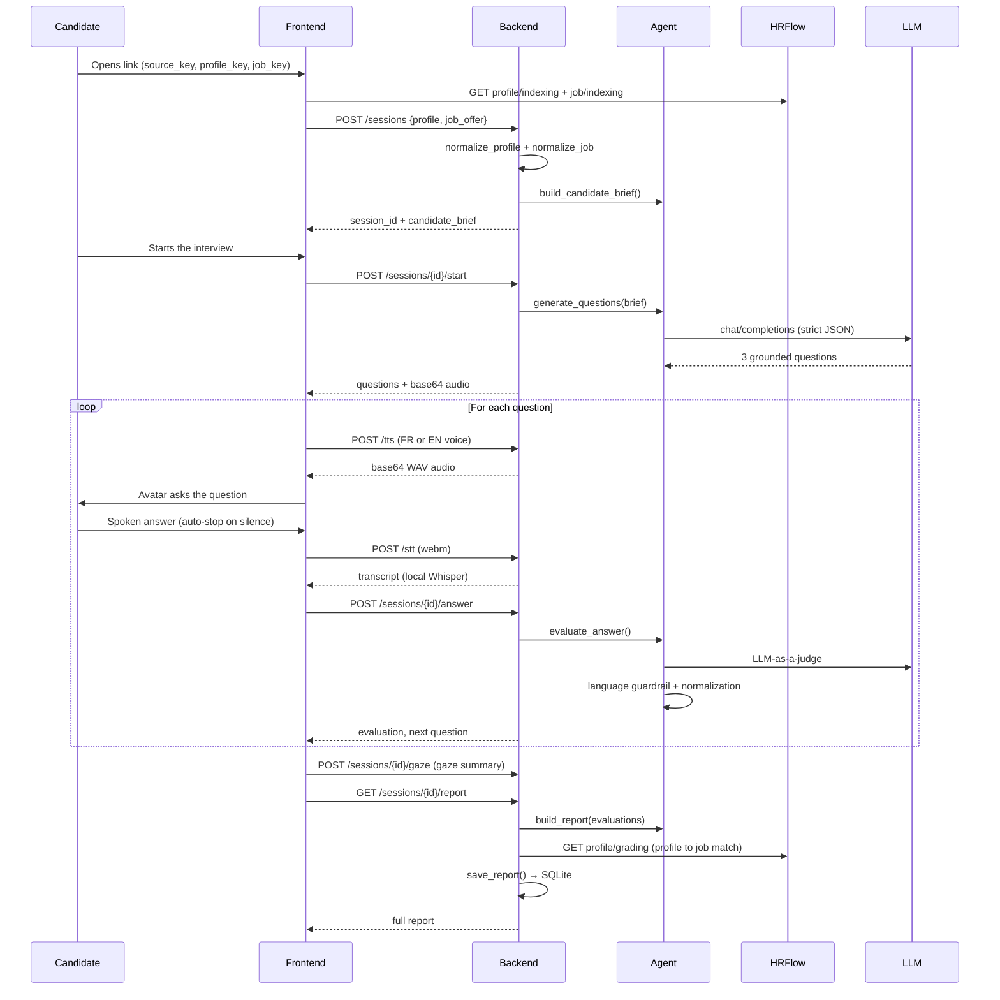

# Remi AI: AI-Powered Screening Interviews

**Finalist, HRFlow.ai AI Hackathon**

An AI recruiter that runs a video interview with a candidate, scores it, and hands the hiring team an actionable report in 10 minutes, starting from a single HRFlow profile.

Built at the HRFlow.ai hackathon, March 27-28, 2026.


> **Note on language.** The product UI and the generated interview questions are in **French**, by design: the hackathon targeted the French recruitment market. Question 2 is always asked in English, as a deliberate language-proficiency test. The codebase, API and documentation are in English.

---

## The Problem

Screening is the bottleneck of recruiting. A recruiter spends **20 to 30 minutes per candidate** on a first phone interview whose purpose is almost always identical: confirm the résumé tells the truth, gauge communication skills, test English proficiency, and measure the actual fit for the role.

Across hundreds of applications, that first filter simply does not scale. The result: strong profiles that never get a call, interviews run without a shared rubric, and decisions that are hard to compare across candidates.

## The Solution

**Remi AI** automates that first filter without reducing it to keyword matching.

Given an **HRFlow profile** and a **target job offer**, the app generates a short video interview (3 questions), delivers it through an **animated talking avatar**, transcribes and evaluates the candidate's answers, and produces a **structured report** the recruiter reads from a dashboard.

What sets the approach apart:

| | Traditional screening | Remi AI |
|---|---|---|
| **Questions** | Generic reusable script | Generated from **both the profile and the job offer**, grounded in the skills the role actually requires |
| **Evaluation** | Recruiter's subjective notes | **LLM-as-a-judge** across five or six subscores, with a deterministic fallback |
| **Fit** | Gut feeling | Cross-check of the **interview score** against **HRFlow's profile-to-job grading** |
| **English** | Rarely tested | **Mandatory English question** with language detection and an automatic penalty |
| **Integrity** | No control | **Gaze tracking** (MediaPipe) to flag answers being read off-camera |

---

## User Journey

### Candidate side

```
Personalized link  →  Briefing  →  Video interview  →  Confirmation
(source_key +         profile,     3 questions,        "thanks, the
 profile_key +        target job,  avatar + voice,      recruiter will
 job_key)             permissions  live transcription   be in touch"
```

1. **Landing.** The candidate opens a link such as
   `?source_key=…&profile_key=…&board_key=…&job_key=…`.
   The app pulls their profile and the job offer from HRFlow, then opens an interview session.
2. **Briefing.** Profile recap (seniority, years of experience, skills, certifications, languages), a reminder of the target role, and a **camera + microphone** permission check before starting.
3. **Interview.** A video-call-style interface: the avatar asks the question out loud, recording starts automatically, and **silence detection** (2 s) submits the answer with no click required. A "switch to text" toggle stays available as a fallback.
4. **Completion.** The candidate **never sees their scores**. They get a simple confirmation; the report belongs to the recruiter.

### Recruiter side

```
HR dashboard        →  Detailed report
stats, sort by         dual score, radar,
score/date/name,       strengths & risks,
recommendations        verbatims, integrity signal
```

- **Dashboard.** Every completed interview, with headline stats (total, "strongly recommended", "recommended", average score) and sorting by date, score or name.
- **Report.** Two tabs:
  - *Overview*: interview score **and** HRFlow matching score side by side, subscore radar, category scores, strengths / concerns, and a **behavioral signals** banner.
  - *Per-question breakdown*: score, subscores, the judge's rationale, and the **full transcript** of each answer (collapsible), with print-to-PDF support.

---

## The Product

### Interview report

Two independent scores sit side by side: **interview** (what the candidate said) and **HRFlow** (profile-to-job fit). Below them, the per-dimension breakdown and the hiring recommendation. The recruiter can open the candidate's résumé or export the report in one click.


### Detailed analysis

The subscore radar (relevance, specificity, consistency, job alignment, clarity, technical accuracy), per-question scores, and the strengths and concerns extracted from the judge's evaluations.


### HR dashboard

Every completed interview with its score and recommendation, headline statistics, and sorting by date, score or name.


---

## Key Features

### Grounded question generation

The three questions are not pulled from a question bank. They are generated by an LLM from a **candidate brief**: a compact synthesis built from the normalized profile (strongest experiences, inferred seniority, top skills) **crossed with** the job offer (target skills, key requirements). The output format is strictly enforced:

```json
{
  "id": "q1",
  "category": "intro_synthesis",
  "question": "…",
  "why_it_matters": "…",
  "expected_signals": ["…"],
  "scoring_criteria": ["…"],
  "priority": 1
}
```

The interview arc is guaranteed: **q1** background synthesis, **q2** English proficiency test, **q3** validation of the role's key skills.

### Conversational avatar (TTS + STT)

- **Voice**: speech synthesis via **Gradium**, with two distinct voices, French and English for the language question.
- **Avatar**: a Lottie animation driven by four states (`idle`, `speaking`, `listening`, `thinking`), composited over an office backdrop for a video-call feel.
- **Transcription**: **Whisper large-v3-turbo running locally** through `mlx-whisper`, so candidate audio never reaches a third-party transcription service.
- **Silence detection**: real-time RMS analysis of the microphone stream; after 2 s of silence (and at least 1 s of speech), the answer is submitted automatically.

### English test with a hard guardrail

Question 2 is always asked **in English**, with the English voice, and the candidate is warned on the preceding screen. Two layers of enforcement:

1. The judge prompt caps any non-English answer at 15/100.
2. A **deterministic language detector** on the server (French marker-word ratio > 15%) caps the score at 10/100 and its subscores at 15/100, regardless of what the LLM decided. The guardrail also applies to the deterministic fallback path.

### Gaze-based integrity check

A **MediaPipe** `FaceLandmarker` (478-point model with iris refinement) runs in the browser throughout the interview:

- computes the **iris position ratio** between the two corners of each eye; outside `[0.45, 0.55]` the gaze counts as off-screen;
- **6-frame debounce** (~200 ms) so a blink never triggers a false positive;
- distinguishes `look_away` (gaze off camera) from `no_face` (candidate out of frame);
- shows a discreet live nudge to the candidate (*"Look at the camera"*), then sends an aggregate to the backend at the end of the interview;
- verdict in the HR report: past **15 s cumulative**, the interview is flagged as **likely cheating**.

All video processing stays **client-side**: only the numeric summary (event count, durations) is sent to the server, never the frames.

### Dual score: interview and HRFlow matching

The report puts two independent measurements next to each other:

- the **interview score**: what the candidate actually said, as judged by the LLM;
- the **HRFlow grade**, obtained from the `profile/grading` API (`grader-hrflow-profiles-titan` algorithm), which rates profile-to-job fit from structured data.

A candidate who scores high on the interview but low on matching (or the reverse) becomes immediately visible to the recruiter.

---

## Architecture



### Interview lifecycle



---

## Tech Stack

| Area | Choice | Why |
|---|---|---|
| **API** | FastAPI + Pydantic | Strict validation of HRFlow payloads and auto-generated OpenAPI docs |
| **Python monorepo** | `uv` workspace (`backend` + `agent`) | Interview logic stays a standalone, testable package, reusable outside the web layer |
| **UI** | React 18 + TypeScript + Vite | Fast iteration, HMR, strictly typed API contracts |
| **Styling** | Tailwind CSS | A coherent design system on hackathon time |
| **Charts** | Recharts | Subscore radar and per-question bars |
| **Avatar** | `lottie-react` | Lightweight vector animation, drivable by state |
| **Vision** | `@mediapipe/tasks-vision` | Iris tracking **in the browser**, no frames leave the device |
| **STT** | `mlx-whisper` (large-v3-turbo) | **Local** transcription, no candidate audio sent to a third party |
| **TTS** | Gradium | Natural multilingual voices, two `voice_id`s (FR / EN) |
| **LLM** | OpenAI-compatible endpoint | Swappable open-source model, `response_format: json_object` |
| **Data** | SQLite + in-memory store | Volatile sessions in RAM, final reports persisted |
| **ATS** | HRFlow.ai API | Profiles, jobs, résumé parsing and profile-to-job grading |

---

## Getting Started

### Prerequisites

- **Python ≥ 3.11** and [`uv`](https://docs.astral.sh/uv/)
- **Node.js ≥ 18** and npm
- **ffmpeg** for audio conversion before transcription: `brew install ffmpeg` / `apt install ffmpeg`
- **Important:** transcription uses `mlx-whisper`, which requires an **Apple Silicon Mac**. On any other platform `/stt` returns `available: false` and the UI falls back to **text input** (see [Graceful Degradation](#graceful-degradation)).
- **HRFlow.ai** keys, an **OpenAI-compatible LLM endpoint**, and a **Gradium** key. All are optional: every one has a fallback.

### 1. Clone and configure

```bash
git clone git@github.com:remicku/hrflow-ai-hackathon-2026.git
cd hrflow-ai-hackathon-2026

# Backend configuration
cp .env.example .env
$EDITOR .env

# Frontend configuration
cp frontend/.env.example frontend/.env
$EDITOR frontend/.env
```

### 2. Run the backend

```bash
uv sync
uv run --package backend uvicorn backend.main:app --reload --port 8000
```

- API: <http://localhost:8000>
- Interactive docs: <http://localhost:8000/docs>
- Healthcheck: <http://localhost:8000/health>

### 3. Run the frontend

```bash
cd frontend
npm install
npm run dev
```

The app is served at <http://localhost:3000>. Vite proxies `/api` to the backend and `/hrflow-api` straight to `https://api.hrflow.ai/v1`.

### 4. Use the app

| Role | URL |
|---|---|
| **Recruiter** | `http://localhost:3000` (opens the HR dashboard directly) |
| **Candidate** | `http://localhost:3000/?source_key=<key>&profile_key=<key>&board_key=<key>&job_key=<key>` |

`reference` is accepted in place of `profile_key`. With no interview parameters, the app renders the dashboard.

---

## Environment Variables

### Backend (`.env` at the repository root)

| Variable | Required | Description |
|---|---|---|
| `HRFLOW_API_KEY` | For any HRFlow call | HRFlow.ai API key |
| `HRFLOW_USER_EMAIL` | For grading | HRFlow account email. **Mandatory** for `profile/grading`; without it the matching score is missing from the report |
| `HRFLOW_BASE_URL` | No | Defaults to `https://api.hrflow.ai/v1` |
| `HRFLOW_SOURCE_KEY` | No | Default source for profiles and résumé parsing |
| `HRFLOW_BOARD_KEY` | No | Default board for job offers |
| `OPEN_SOURCE_LLM_API_KEY` | No | Key for the OpenAI-compatible LLM endpoint |
| `OPEN_SOURCE_LLM_BASE_URL` | No | Base URL (e.g. `https://…/v1`) |
| `OPEN_SOURCE_LLM_MODEL` | No | Model identifier |
| `GRADIUM_API_KEY` | No | Gradium API key for speech synthesis |
| `GRADIUM_VOICE_ID` | No | Default voice (the interview screen supplies its own FR/EN `voice_id`s) |
| `WHISPER_MODEL` | No | Defaults to `mlx-community/whisper-large-v3-turbo`. Leave it **commented out** rather than empty: an empty value overrides the default instead of falling back to it |

> **Note.** The three `OPEN_SOURCE_LLM_*` variables are all-or-nothing: if any is missing, the agent switches to deterministic mode.

### Frontend (`frontend/.env`)

| Variable | Description |
|---|---|
| `VITE_HRFLOW_API_KEY` | Key used to read the profile and job offer from the browser |
| `VITE_HRFLOW_USER_EMAIL` | HRFlow account email |
| `VITE_HRFLOW_SOURCE_KEY` | Default source when absent from the URL |
| `VITE_HRFLOW_BOARD_KEY` | Default board when absent from the URL |

---

## API Reference

Full, executable documentation at <http://localhost:8000/docs>.

| Method | Endpoint | Description |
|---|---|---|
| `GET` | `/health` | Healthcheck |
| `POST` | `/sessions` | Creates a session from an HRFlow profile (+ optional job offer): normalization, validation, candidate-brief construction |
| `POST` | `/sessions/{id}/start` | Generates the 3 questions (idempotent) and returns the first one with its audio |
| `POST` | `/sessions/{id}/answer` | Scores one answer and returns the next question |
| `POST` | `/sessions/{id}/gaze` | Stores the gaze-tracking summary |
| `GET` | `/sessions/{id}/report` | Builds the final report, attaches the HRFlow grade, résumé URL and behavioral signals, then persists it |
| `GET` | `/jobs` | Lists job offers from an HRFlow board (proxies `jobs/searching`) |
| `POST` | `/profile/parse-cv` | Parses a résumé (PDF/DOC/DOCX) through HRFlow and creates a session directly |
| `POST` | `/stt` | Transcribes an audio file locally (Whisper) |
| `POST` | `/tts` | Synthesizes text into audio (Gradium) |
| `GET` | `/hr/interviews` | List of completed interviews (HR view) |
| `GET` | `/hr/interviews/{id}` | Full persisted report for one interview |

<details>
<summary><b>Example: create and run an interview</b></summary>

```bash
# 1. Create the session
curl -X POST http://localhost:8000/sessions \
  -H "Content-Type: application/json" \
  -d '{"profile": { "...HRFlow profile..." }, "job_offer": { "...HRFlow job..." }}'
# → { "session_id": "…", "candidate_brief": { … } }

# 2. Generate the questions
curl -X POST http://localhost:8000/sessions/<session_id>/start

# 3. Answer a question
curl -X POST http://localhost:8000/sessions/<session_id>/answer \
  -H "Content-Type: application/json" \
  -d '{"question_id": "q1", "transcript": "I led the backend rewrite…"}'

# 4. Fetch the report
curl http://localhost:8000/sessions/<session_id>/report
```

</details>

---

## Scoring Model

### Per-answer subscores

Every answer is scored out of **100** across five subscores, plus a conditional sixth:

| Subscore | What it measures |
|---|---|
| `relevance` | Does the answer actually address the question? |
| `specificity` | Concrete examples, numbers, action verbs |
| `consistency_with_profile` | Alignment with the résumé; surfaces gaps between what is claimed and what was lived |
| `job_alignment` | Explicit connection to the role's requirements |
| `clarity` | Structure and length of the answer |
| `technical_accuracy` | *Only* for `skill_validation` and `situational_or_technical` questions |

The judge prompt is deliberately **charitable**: it reminds the model that the candidate is answering out loud, unprepared, tells it to round up when in doubt, and requires at least one strength even on a weak answer. A floor (45/100) protects honest but short answers.

### Aggregation

| Report score | Computation |
|---|---|
| `overall_score` | Mean of `normalized_score` |
| `communication_score` | Mean of `clarity` |
| `technical_score` | Mean of `technical_accuracy` (falls back to `overall_score` when not applicable) |
| `profile_consistency_score` | Mean of `consistency_with_profile` |
| `job_alignment_score` | Mean of `job_alignment` |

### Final recommendation

| Condition | Verdict |
|---|---|
| `overall ≥ 80` **and** ≤ 2 concerns | **Strongly recommended** |
| `overall ≥ 68` | **Recommended** |
| `overall ≥ 55` | **Mixed** |
| otherwise | **Not recommended** |

---

## Graceful Degradation

One principle drove the whole implementation: **no unavailable external service may break the demo**. Every integration has a fallback path.

| Service missing or failing | Behavior |
|---|---|
| **LLM** unconfigured or returning invalid output | `InterviewAgent` emits 3 deterministic questions built from the brief (name, target role, company, skills), and `InterviewScorer` switches to full **heuristic scoring** (lexical overlap, digit density, action verbs, sentence length) |
| **LLM JSON** wrapped in Markdown fences | Code fences are stripped and the payload re-parsed before structural validation |
| **Gradium** unconfigured | `/tts` returns `available: false`; the frontend displays the question on screen and allows 2.5 s of reading time |
| **Whisper / ffmpeg** unavailable | `/stt` returns `available: false`; the UI offers **text input** (the toggle is available at any time anyway) |
| **MediaPipe** failing to initialize | Gaze tracking silently stops, the interview continues, and the behavioral section disappears from the report |
| **HRFlow grading** impossible (missing keys or identifiers) | `null` in the report; the UI simply hides the second score |
| **Gaze summary upload** failing | Deliberately swallowed: the data is optional and must never block the end of the interview |

The deterministic fallback keeps **exactly the same output contract** as the LLM path: the frontend has no conditional branch to handle.

---

## Repository Layout

```
hrflow-ai-hackathon-2026/
├── agent/                       # Standalone Python package: the interview logic
│   ├── interview_agent.py       # Candidate brief + question generation (LLM + fallback)
│   ├── scorer.py                # LLM-as-a-judge, language guardrail, heuristic scoring
│   ├── report_builder.py        # Aggregates evaluations into the recruiter report
│   └── prompts.py               # System prompts and prompt builders
│
├── backend/                     # FastAPI web service
│   ├── main.py                  # REST endpoints, documented Pydantic schemas
│   ├── hrflow_client.py         # HRFlow client: normalization, résumé parsing, grading
│   ├── session_store.py         # Thread-safe in-memory session store
│   ├── database.py              # SQLite persistence for final reports
│   ├── gradium_tts.py           # Null-safe speech synthesis
│   └── voxtral_stt.py           # Local transcription via mlx-whisper + ffmpeg
│
├── frontend/                    # React + TypeScript SPA
│   └── src/
│       ├── App.tsx              # State-based routing (candidate vs. recruiter)
│       ├── api.ts               # Typed API client
│       ├── types.ts             # Contracts shared with the backend
│       ├── pages/               # Landing · Briefing · Interview · Completion · HRDashboard · Report
│       ├── components/          # Avatar (Lottie) · Webcam · ScoreBar
│       ├── hooks/               # useElevenLabsSTT · useGazeTracking · useMediaPermissions
│       └── avatars/             # Lottie animations and video-call backdrop
│
├── docs/assets/                 # Demo GIF and product screenshots
├── pyproject.toml               # uv workspace (agent + backend)
└── .env.example                 # Backend configuration template
```

---

## Known Limitations and Roadmap

This is an unapologetic **hackathon prototype**. The shortcuts taken are listed here in full.

**Current limitations**

- **In-memory sessions.** Restarting the backend loses interviews in flight. Only final reports survive (SQLite). Moving to Redis or Postgres is the first hardening step.
- **HRFlow key exposed to the browser.** The frontend queries HRFlow directly through a Vite proxy. Fine for a local demo; in production every call should go through the backend.
- **`mlx-whisper` is Apple Silicon only.** The `voxtral_stt.py` module keeps the name of the model originally considered; the final implementation runs Whisper through MLX. A `faster-whisper` backend would make transcription cross-platform.
- **No authentication** on the HR dashboard or on candidate interview links.
- **Endpoints not wired to the UI.** `POST /profile/parse-cv` and `GET /jobs` work and are testable from `/docs`, but the résumé-upload screen was cut from the final flow.
- **CORS restricted** to `localhost:3000` / `127.0.0.1:3000`.
- **No automated tests.** Hackathon time went to the demo.

**Roadmap**

- Session persistence and resuming an interrupted interview
- Adaptive interviewing: question *n+1* generated from the answer to question *n*
- Complementary audio signals (multiple voices, monotone reading) to strengthen the integrity check
- Multi-candidate comparison and ranking for a single job offer
- Native PDF export of the report and a webhook to push results back into HRFlow
- Integration tests covering the deterministic fallback paths
